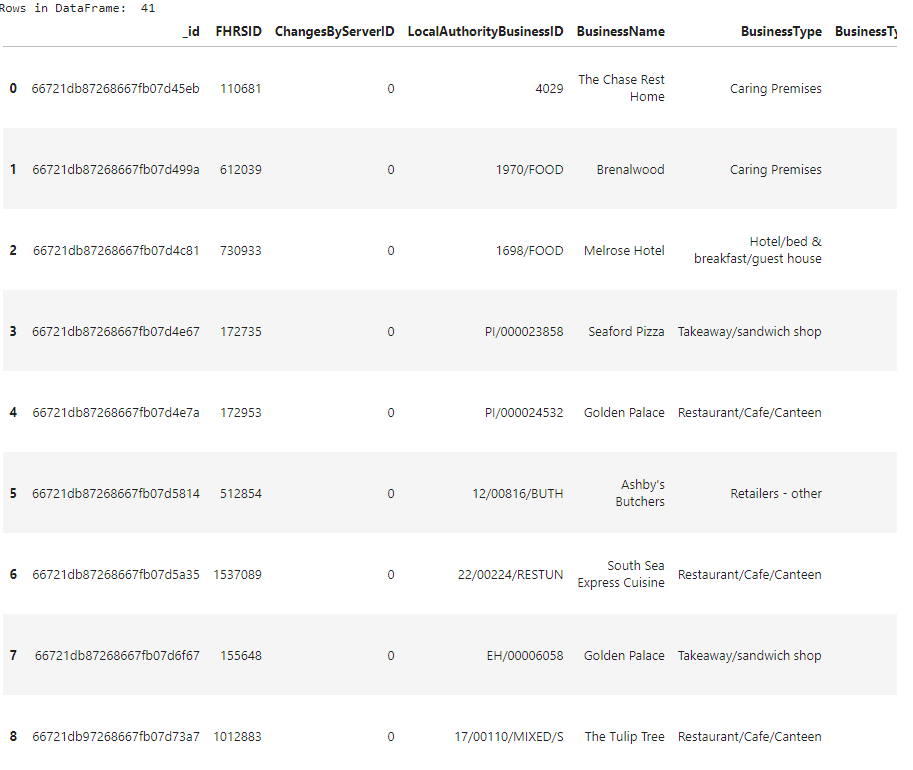

**NOSQL / PYMONGO CHALLENGE**

**(1) Project Overview and Purpose:**

The purpose of this exercise is to assist the editorial staff of a food magazine, _Eat Safe, Love_, plan for future articles by their journalists and food critics, based on the Food Standards Agency's food hygiene ratings at various establishments in the United Kingdom (UK).

**(2) Dataset Description:**

The dataset used for this exercise is a file within the **Resources** folder name "establishments.json. It contains specifics about UK establishments (Address information; Business Name; Business Type; Business Type ID; Changes By Server ID; Distance; FHRSID; Local Authority information; New Rating Pending; Phone; PostCode; Rating Date; Rating Key; Rating Value; Right To Reply; Scheme Type; identification number; geocode; links; metadata; and scores.

**(3) Data Cleaning and Preprocessing:**

The 'establishments' collection was updated due to a new halal restaurant in Greenwich is needed for the analysis, but hasn't been rated yet. The Business Type ID was updated for this new establishment.

 Establishments within the Dover Local Authority are not of interest to the magazine staff so they were removed from the database, and a confirmation check of deletion was made.

Latitudes and Longitudes [within the geocode information] were updated from string values to decimel numbers.

Rating Values were updated from string values to integer numbers.
 

**(4) Data Visualization Techniques:**

DataFrames were generated, but no plots; maps; graphs; or other visualizations were part of this exercise.

**(5) Results and Analysis:**

(a) Find the establishments with a hygiene score of 20 - **41** (See example of DataFrame below)

(b) Find the establishments with London as the Local Authority and has a RatingValue greater than or equal to 4 - **33** (See example of DataFrame below)

(c) What are the top 5 establishments with a RatingValue rating value of 5, sorted by lowest hygiene score, nearest to the new restaurant added, "Penang Flavours"?

(d) How many establishments in each Local Authority area have a hygiene score of 0? - **55** (See example of DataFrame below)

**(6) Ethical Considerations:**

This dataset does not appear to contain any sensitive or restricted information. It appears to be publically available from a public health and information standpoint.

**(7) Instructions for Interacting with the Project:**

(a) Part 1: Database and Jupyter Notebook Set Up and Part 2: Update the Database - code posted in the main folder as an ipynb filed titled "NoSQL_setup_roop.ipynb"

(b) Part 3: Exploratory Analysis - code posted in the main folder as an ipynb file titled "NoSQL_analysis_roop.ipynb"

(c) DataFrames are stored in the Output folder as .png files

**(8) Citations:**

(a) Xpert Learning Associate - questions regarding:

     (i) Questions to further understanding of assignment (e.g., more information on pipelines)

     (ii) Code syntax questions when errors received
